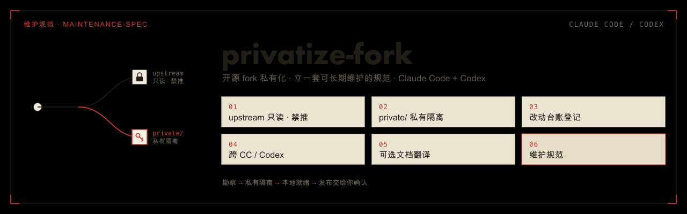
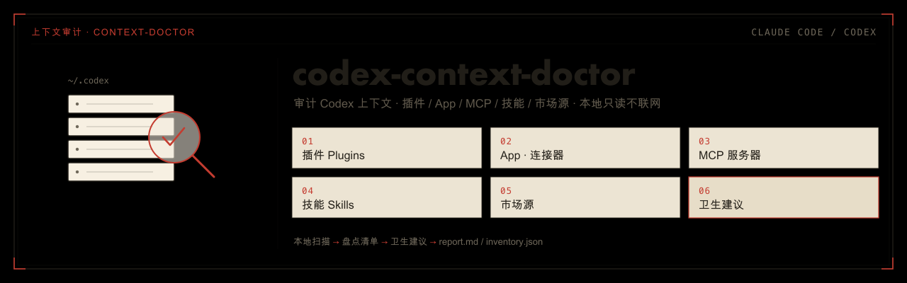
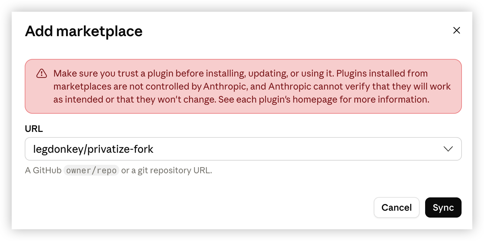
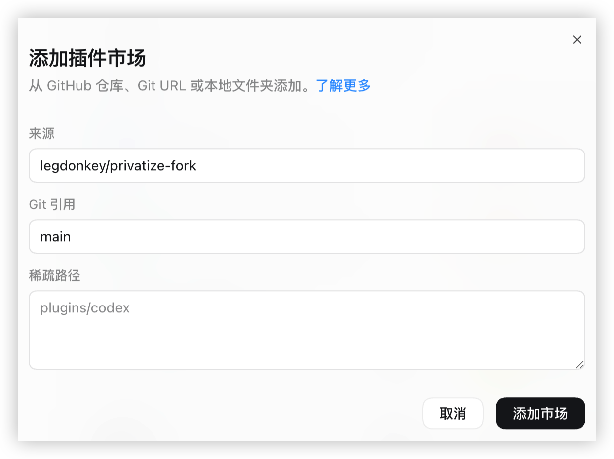

# legdonkey-plugins — Claude Code 与 Codex 插件集市

<p align="center">
  <a href="https://github.com/legdonkey/legdonkey-plugins/releases"></a>
  
  
  <a href="https://agentskills.io"></a>
</p>

> 两个跨 **Claude Code** 与 **Codex** 的独立插件，同一个 `legdonkey` 市场，按需各装各的。底层是开放标准 [skill](https://agentskills.io)，都**只在手动点名时运行、不会自动调用**。

## 插件

### [privatize-fork](plugins/privatize-fork/) — 开源 fork 一次性私有化

<p align="center">
  <a href="plugins/privatize-fork/"></a>
</p>

把 clone 下来的开源项目 fork 私有化：upstream 只读跟踪 + 禁推、`private/` 隔离与维护规范、文档增量翻译、写 `CLAUDE.md`/`AGENTS.md` 指针——让私有 fork 能长期跟踪上游、又把定制干净隔离。**→ [详细说明](plugins/privatize-fork/README.md)**

### [codex-context-doctor](plugins/codex-context-doctor/) — Codex 上下文审计

<p align="center">
  <a href="plugins/codex-context-doctor/"></a>
</p>

本地只读扫描 `~/.codex`，盘点装了哪些插件 / App·连接器 / MCP / 技能 / 市场源，给出重名、旧缓存、配置不一致等卫生建议。纯 Python 3 + Bash，不联网。**→ [详细说明](plugins/codex-context-doctor/README.md)**

## 安装

两个插件在同一个市场，CC 与 Codex 都能装，命令行与桌面端图形界面都行。装完重启对应客户端即可。

> **想一键装两边？** 跑 `./install-plugins.sh`，它用各自 CLI 把两个插件装进 Claude Code 与 Codex。每个平台的 CLI 与桌面端共享配置，装一次即覆盖两者。需本机有 `claude` / `codex` CLI。

### ① Claude Code —— 插件市场

**命令行**

```
/plugin marketplace add legdonkey/legdonkey-plugins
/plugin install privatize-fork@legdonkey
/plugin install codex-context-doctor@legdonkey   # 按需，可只装一个
```

之后用 `/plugin marketplace update` 拉取更新。

**桌面端图形界面**：打开插件设置里的「Add marketplace」对话框，在 URL 填 `legdonkey/legdonkey-plugins`，点 **Sync** 添加市场；再到插件列表按需安装。



> 插件方式的 skill 触发名带命名空间：`/privatize-fork:privatize-fork`、`/codex-context-doctor:codex-context-doctor`。

### ② Codex —— 插件市场

**命令行**

```bash
codex plugin marketplace add legdonkey/legdonkey-plugins --ref main
codex plugin add privatize-fork@legdonkey
codex plugin add codex-context-doctor@legdonkey   # 按需，可只装一个
```

**桌面端图形界面**：设置 →「添加插件市场」，来源填 `legdonkey/legdonkey-plugins`、Git 引用 `main`（稀疏路径留空），点「添加市场」；再到插件列表按需安装。



> 两个插件分别在 `plugins/privatize-fork`、`plugins/codex-context-doctor` 子目录（标准布局），任意 Codex 版本都能装。

> **不会自动调用**：CC 靠 frontmatter `disable-model-invocation: true`，Codex 靠 `agents/openai.yaml` 的 `allow_implicit_invocation: false`——两边都只能由你手动触发。

## 仓库结构

```text
.claude-plugin/marketplace.json                # CC 市场清单（列出 2 个插件）
.agents/plugins/marketplace.json               # Codex 市场清单（列出 2 个插件）
plugins/
├── privatize-fork/                            # 插件①：开源 fork 私有化
│   ├── .claude-plugin/plugin.json             #   CC 插件清单
│   ├── .codex-plugin/plugin.json              #   Codex 插件清单（skills 指向 ./skills/）
│   ├── assets/                                #   该插件 README 配图（banner / features）
│   ├── README.md                              #   插件详细说明
│   └── skills/privatize-fork/                 #   技能本体（SKILL.md + scripts + references）
└── codex-context-doctor/                      # 插件②：审计 Codex 上下文
    ├── .claude-plugin/plugin.json             #   CC 插件清单
    ├── .codex-plugin/plugin.json              #   Codex 插件清单
    ├── assets/                                #   该插件 README 配图（banner / audit-overview）
    ├── README.md                              #   插件详细说明
    └── skills/codex-context-doctor/           #   技能本体（SKILL.md + scripts）
install-plugins.sh                             # 一键把两个插件装进 CC + Codex
assets/                                        # 共享配图：安装截图 + build-svg.sh（生成各插件 SVG）
README.md                                      # 本文件（仓库总览 / 导航）
```
