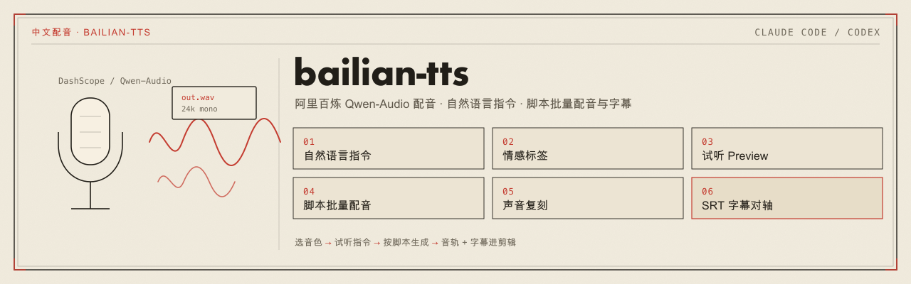

<p align="center">
  
</p>

# bailian-tts

> 一个跨 **Claude Code** 与 **Codex** 的插件（基于开放标准 [skill](https://agentskills.io)）：用阿里百炼 `qwen-audio-3.1-tts-flash` 把文案合成自然语音。
>
> ← 返回[仓库总览](../../README.md) ｜ 姊妹插件：[privatize-fork](../privatize-fork/) / [context-doctor](../context-doctor/)

同一份技能可安装到 Claude Code 与 Codex。它固定使用百炼当前一代的 `qwen-audio-3.1-tts-flash`：68 个系统音色都接受任意自然语言指令，文案里可以直接嵌入情感与拟声标签，还能用自己的录音复刻音色。

## 解决什么问题

做视频、PPT、课件、演示或产品旁白时，常见问题不是“能不能合成语音”，而是每次都要重新写 SDK 调用、查音色、记模型和音色的绑定关系、处理 `411` 报错，再拿音频时长去对时间轴、手打字幕。

`bailian-tts` 把这些固定动作收进一个技能：

| 能力 | 说明 |
|------|------|
| **音色清单** | 内置 68 个系统音色数据（多语种与方言 / 精品中文 / 精品英文 / 其他），可按性别、场景筛选。 |
| **自然语言指令** | `--instruct "沉稳的中年女声，语速偏慢"` 原样传给模型，不需要固定句式；也可用 `--emotion` 快捷指定情感。 |
| **文本内标签** | 在文案里写 `[excited]`、`[serious]` 切换情绪，写 `[laughing]`、`[sighing]` 插入拟声。 |
| **方言与多语种** | 4 个音色支持上海话、广东话、东北话、重庆话等 8 种方言和 8 种外语，用指令切换。 |
| **先试听再生成** | `preview` 合成一句并播放；`gen` 生成正式 `wav`，统一规范化为 24kHz 单声道并打印时长。 |
| **脚本批量配音** | `script` 按脚本逐段生成，每段可切换音色和指令，输出分段 `wav`、拼接好的 `all.wav`、`subtitles.srt` 和 `manifest.json`，可直接拖进剪辑工具。 |
| **声音复刻** | `clone` 直接接收本地录音（m4a/mp3/wav 等），自动转码、检查时长、上传百炼临时存储并完成复刻，无需自备 OSS；`voices --mine` 查询、`delete` 删除。 |
| **提前拦截错配** | 音色不属于本模型（其它模型的系统音色、为其它模型创建的复刻音色）时直接提示，不让服务端只回一个 `411`。 |

## 安装

插件名 `bailian-tts@legdonkey`。完整安装方式（含桌面端图形界面、一键脚本 `install-plugins.sh`）见[根 README 的安装区](../../README.md#安装)。命令行速记：

```bash
# Claude Code
/plugin marketplace add legdonkey/legdonkey-plugins
/plugin install bailian-tts@legdonkey

# Codex
codex plugin marketplace add legdonkey/legdonkey-plugins --ref main
codex plugin add bailian-tts@legdonkey
```

装完重启对应客户端。触发名：**Claude Code** 用 `/bailian-tts`（插件命名空间下 `/bailian-tts:bailian-tts`）；**Codex** 用 `$bailian-tts`。**不会自动调用**——CC 靠 frontmatter `disable-model-invocation: true`、Codex 靠 `agents/openai.yaml` 的 `allow_implicit_invocation: false`，只能由你手动点名。

## 运行环境

这个插件会调用阿里百炼 DashScope API（北京地域），并在本机生成音频文件。使用前需要：

```bash
python3 -m venv ~/.bailian-tts-venv
~/.bailian-tts-venv/bin/pip install -i https://mirrors.aliyun.com/pypi/simple/ dashscope
```

上面用的是阿里云 PyPI 镜像；如需校验版本，可对照官方源 `https://pypi.org/project/dashscope/`。

API key 读取顺序是环境变量 `DASHSCOPE_API_KEY`，然后是 `~/.dashscope_key`。推荐把 key 放到 `~/.dashscope_key`，不要写进项目文件或对话内容。

还需要本机有 `ffmpeg`；macOS 试听播放用系统自带的 `afplay`。

## 用法

手动触发后，告诉模型你要合成的文案、想要的语气和用途。典型流程是：

1. 用 `voices --gender 女 --scene 新闻播报` 之类的条件缩小音色范围；
2. 用 `preview` 试听 1 到 2 个候选，确定音色和指令；
3. 单段用 `gen`；多段旁白写成脚本交给 `script`，拿到 `all.wav` 和 `subtitles.srt`；
4. 想用自己的声音：录 10～20 秒清晰朗读（如用 macOS 语音备忘录），把文件路径交给 `clone` 即可。

脚本格式示例（每行一段，`@voice` / `@instruct` 切换之后各段的设置）：

```text
@voice xuyuyuan_v3.1
@instruct 沉稳知性的女声，语速适中
各位好，欢迎来到今天的发布会。
@voice yuxiaoyun_v3.1
@instruct 年轻活泼的女声，语速偏快
[excited]它真的太好用了！[laughing]
```

底层脚本是 `skills/bailian-tts/scripts/tts.py`，会从自身相邻的 `references/voices.json` 读取音色数据，不依赖固定安装路径。

## 模型支持边界

只支持 `qwen-audio-3.1-tts-flash`。音色与模型强绑定：系统音色以 `_v3.1` 结尾，复刻音色 ID 以 `qwen-audio-3.1-tts-flash-` 开头。

不在范围内：

- `qwen-audio-3.1-tts-next`（多人对话、配乐、音效一体生成）——能力与调用方式不同，需单独设计；
- 声音设计（按文字描述生成音色）——官方目前只对 `qwen-audio-3.0-tts-*` 开放；
- 百炼上的其它语音合成模型。

## 插件结构

```text
plugins/bailian-tts/
├── .claude-plugin/plugin.json      # CC 插件清单
├── .codex-plugin/plugin.json       # Codex 插件清单（skills 指向 ./skills/）
├── assets/                         # README 配图（src/ 为可编辑源，由根 assets/build-svg.sh 生成）
└── skills/bailian-tts/
    ├── SKILL.md                    # 入口（禁自动调用，只手动点名才跑）
    ├── agents/openai.yaml          # Codex 专属元数据
    ├── scripts/tts.py              # 合成、试听、脚本批量配音、声音复刻
    └── references/
        ├── voices.md               # 指令、文本标签、复刻与排错说明
        └── voices.json             # qwen-audio-3.1-tts-flash 音色清单
```
