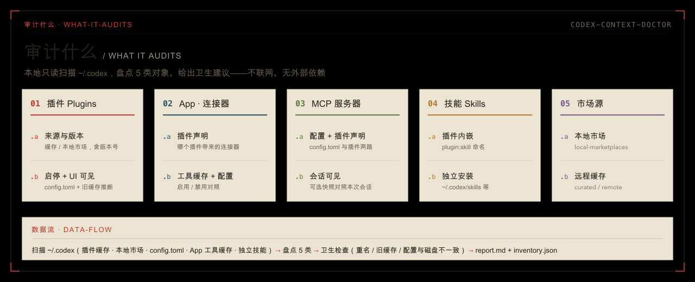

<p align="center">
  
</p>

# codex-context-doctor

> 一个跨 **Claude Code** 与 **Codex** 的插件（基于开放标准 [skill](https://agentskills.io)）：**本地审计 Codex 的上下文构成**——盘点装了哪些插件 / App·连接器 / MCP / 技能 / 市场源，并给出卫生建议。
>
> ← 返回[仓库总览](../../README.md) ｜ 姊妹插件：[privatize-fork](../privatize-fork/)

Codex 装多了之后，常分不清「现在到底加载了什么、谁和谁重名、哪些是旧缓存」。这个插件只读扫描 `~/.codex`，把上下文构成摊开给你看——**纯本地、不联网、无外部依赖**，只在你手动点名时才跑。

## 审计什么

<p align="center">
  
</p>

| 对象 | 扫描内容 |
|------|---------|
| **插件 Plugins** | 来源（缓存 / 本地市场）、版本、`config.toml` 里的启停，以及在插件页是否可见的推断 |
| **App · 连接器** | 由插件声明的连接器 + App 工具缓存 + 配置态（启用/禁用）对照 |
| **MCP 服务器** | 两路来源——`config.toml` 配置 与 插件声明；可选对照本次会话是否可见 |
| **技能 Skills** | 插件内嵌技能（`plugin:skill` 命名）与独立安装的技能（`~/.codex/skills` 等） |
| **市场源 Marketplaces** | 本地市场（`local-marketplaces`）与远程缓存（curated / remote） |
| **卫生建议** | 重名插件、启用但 UI 隐藏的旧缓存、配置与磁盘不一致、孤立 App 工具等 |

## 安装

插件名 `codex-context-doctor@legdonkey`。**完整安装方式**（含桌面端图形界面、一键脚本 `install-plugins.sh`）见[根 README 的安装区](../../README.md#安装)。命令行速记：

```bash
# Claude Code
/plugin marketplace add legdonkey/privatize-fork
/plugin install codex-context-doctor@legdonkey

# Codex
codex plugin marketplace add legdonkey/privatize-fork --ref main
codex plugin add codex-context-doctor@legdonkey
```

装完重启对应客户端。触发名 `/codex-context-doctor`（插件命名空间下为 `/codex-context-doctor:codex-context-doctor`）。**不会自动调用**——CC 靠 frontmatter `disable-model-invocation: true`、Codex 靠 `agents/openai.yaml` 的 `allow_implicit_invocation: false`，只能由你手动点名。

## 用法

手动触发：

```
/codex-context-doctor
```

它会本地扫描、在带时间戳的临时目录写出 `report.md`（人类可读报告）和 `inventory.json`（完整数据），对话里只回**输出路径 + 一行短摘要**（统计数、重名、建议数）。除非你明确要求，不会把完整报告糊进聊天。

**可选会话快照**：想对照「磁盘装了什么 vs 本次会话真正可见什么」，让它先写一个精简的会话工具/技能 JSON 再带 `--session-snapshot` 跑，报告里会标出每项是否 `visible_in_session`。

## 输出规则

- 默认只写**临时目录**（`${CODEX_CONTEXT_DOCTOR_OUTDIR:-$TMPDIR}/codex-context-doctor/<时间戳>/`）。
- 只有你明确要求持久保存时，才复制 / 重新生成到当前工作区的 `outputs/`。

## 实现

- **纯本地、只读**：扫 `~/.codex`（插件缓存、本地市场、`config.toml`、App 工具缓存、独立技能）+ 独立 skills 目录，不联网、不改任何东西。
- **零外部依赖**：纯 Python 3 + Bash。`config.toml` 用标准库 `tomllib`（Python 3.11+）；更早版本会**显式警告**配置态被跳过，而不是静默当空。

### 插件结构

```text
plugins/codex-context-doctor/
├── .claude-plugin/plugin.json      # CC 插件清单
├── .codex-plugin/plugin.json       # Codex 插件清单（skills 指向 ./skills/）
└── skills/codex-context-doctor/
    ├── SKILL.md                    # 入口（禁自动调用，只手动点名才跑）
    ├── agents/openai.yaml          # Codex 专属元数据
    └── scripts/
        ├── run.sh                  # 包装：建临时输出目录、调 Python、打印短摘要
        └── codex_context_doctor.py # 本地扫描 ~/.codex 生成 report.md / inventory.json
```
