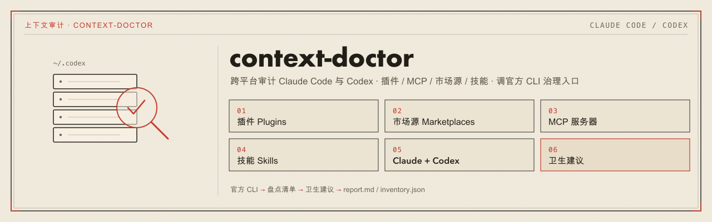
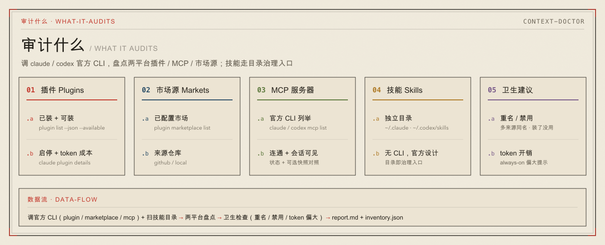

<p align="center">
  
</p>

# context-doctor

> 一个跨 **Claude Code** 与 **Codex** 的插件（基于开放标准 [skill](https://agentskills.io)）：用各平台**官方 CLI 治理入口**盘点插件 / MCP / 市场源，补充 Codex Desktop 远程技能 catalog 与安装缓存，独立技能走目录治理入口，并给出卫生建议。
>
> ← 返回[仓库总览](../../README.md) ｜ 姊妹插件：[privatize-fork](../privatize-fork/)

装多了之后，常分不清「现在到底加载了什么、谁和谁重名、哪些禁用了还占着 token」。这个插件调 `claude` / `codex` 的官方治理命令，把两个平台的上下文构成摊开给你看，输出一份**自包含、可离线打开、可交互的单文件 HTML 报告**。只在你手动点名时才跑。

报告里有：

- **层级树**：Claude Code / Codex CLI / Codex Desktop / Codex 本地共享 tab；OpenAI 公共目录按 CLI/Desktop 投影分开，本地共享域展示其他 marketplace、插件、MCP 与独立文件技能。
- **最贵组件排行**：最贵技能 / 最贵 agent / 最贵插件（标来源插件；只计算明确启用的 Claude 插件，禁用或启用未知的不计入当前成本；Codex 无成本不计入）。
- **会话可见对照**（默认开启）：标出每项在本次会话「真加载了没」——`●` 可见 / `○` 不可见 / `-` 未对照；Codex 额外区分 CLI/Desktop surface。
- **中文用途**：插件/技能/组件用途经缓存翻译成中文，缺失回退英文。
- **交互**：已装/可装过滤、搜索、暗色/浅色主题切换、可排序排行榜。

## 审计什么

<p align="center">
  
</p>

| 对象 | 数据来源 |
|------|---------|
| **插件 Plugins** | Claude Code / Codex 分别调用官方 `plugin list --json --available`。Codex 的 `openai-curated` 留在 CLI，Desktop 公共目录读取最新 `~/.codex/cache/remote_plugin_catalog/*.json` 与 `~/.codex/plugins/cache/openai-curated-remote/`；Desktop 公共目录没有独立开关，缓存中已安装的插件按默认启用记录。其他 marketplace、插件与启用状态归「Codex 本地共享」。已装插件优先从 `~/.codex/plugins/cache/<market>/<plugin>/<version>/` 展开组件 |
| **市场源 Marketplaces** | `claude plugin marketplace list --json` / `codex plugin marketplace list --json`，保留真实源类型（github / git / 本地等） |
| **MCP 服务器** | `claude mcp list` + 逐个 `claude mcp get` 补类型/scope（只读 Type/Scope，**绝不读 Environment 防泄密**）/ `codex mcp list --json`（含启用 + 鉴权方式）。Codex MCP 归本地共享层；插件自带 MCP 会根据声明、运行目录和目标地址保守归属，只有唯一匹配时才移入插件 |
| **技能 Skills** | 两平台都**没有列举独立文件技能的 CLI**，故扫描技能目录。Codex 的 `~/.codex/skills`、`~/.agents/skills` 及项目技能与本地共享插件一起单列，避免在 CLI/Desktop 重复计数 |
| **卫生建议** | 同一 surface 内同名插件多来源、**同名技能跨级覆盖**（按平台区分措辞）、已装但禁用、已启用插件的 always-on token 开销偏大等；禁用插件只提示磁盘清理，不宣称仍占上下文；跨 CLI/Desktop 的同名插件不告警 |

> 设计原则：**公共目录分 surface，本地状态归共享，CLI 优先**。Codex CLI 的 `openai-curated` 与 Desktop 的 `openai-curated-remote` 分开；其他 marketplace、插件、MCP 和文件技能作为同一台机器上的共享层。某平台 CLI 不在 PATH 时自动降级并标注。

## 安装

插件名 `context-doctor@legdonkey`。**完整安装方式**（含桌面端图形界面、一键脚本 `install-plugins.sh`）见[根 README 的安装区](../../README.md#安装)。命令行速记：

```bash
# Claude Code
/plugin marketplace add legdonkey/legdonkey-plugins
/plugin install context-doctor@legdonkey

# Codex
codex plugin marketplace add legdonkey/legdonkey-plugins --ref main
codex plugin add context-doctor@legdonkey
```

装完重启对应客户端。触发名：**Claude Code** 用 `/context-doctor`（插件命名空间下 `/context-doctor:context-doctor`）；**Codex** 用 `$context-doctor`。**不会自动调用**——CC 靠 frontmatter `disable-model-invocation: true`、Codex 靠 `agents/openai.yaml` 的 `allow_implicit_invocation: false`，只能由你手动点名。

## 用法

手动触发（Claude Code 用 `/`、Codex 用 `$`）：

```
/context-doctor      # Claude Code
$context-doctor      # Codex
```

它在带时间戳的临时目录写出 `report.html`（**主产物**：交互式层级报告）、`inventory.json`（完整数据）和 `report.md`（无浏览器时的回退），对话里只回**输出路径 + 一行短摘要**，提示用浏览器打开 HTML。除非你明确要求，不会把完整报告糊进聊天。只想看一个平台时，脚本可加 `--platform claude` 或 `--platform codex`（默认 both）。

**三段式与中文翻译**：插件/技能/组件的中文用途经用户级缓存 `~/.cache/context-doctor/translations.json` 翻译。流程是 ①采集（脚本登记待译英文）→ ②翻译（技能里由模型把缺失项译成中文写回缓存，条目多时按批**并行 subagent** 提效）→ ③`--render-only` 二次渲染出含中文的 HTML。缓存只增不删、命中不重译，缺失时回退英文。源描述本就是中文的不当待译。采集约 1–2 分钟（逐插件 details + MCP 健康检查，均带重试防偶发超时丢数据）。

**会话快照（默认开启）**：脚本读不到 Host 的上下文窗口，不能直接知道「这轮对话里大模型看到了哪些工具/技能」。所以运行采集前，由「跑技能的模型」根据当前会话实际暴露给自己的工具名、技能名生成一份精简 JSON 快照，再带 `--session-snapshot <快照路径>` 跑；Codex 快照必须加 `host_surface: desktop|cli`，报告才会把可见态归到正确 surface。

这不是脚本偷读模型上下文，而是模型按本轮可见清单自报：`●` 表示该技能 / Agent / MCP 名称出现在本轮模型可见清单里，模型知道它存在；`○` 表示本机有但本轮未暴露给模型；`-` 表示未对照。**会话可见不等于允许自动调用**。快照只映射宿主平台和 surface；Codex 本地共享插件、MCP 与文件技能随任一 Codex surface 对照。UUID 命名空间的连接器可加 `source_hint` 兜底匹配。

## 输出规则

- 默认只写**临时目录**（`${CONTEXT_DOCTOR_OUTDIR:-$TMPDIR}/context-doctor/<时间戳>/`）。
- 只有你明确要求持久保存时，才复制 / 重新生成到当前工作区的 `outputs/`。

## 实现

- **CLI 优先、只读**：插件 / 市场 / MCP 优先调官方治理命令；Codex Desktop 公共目录补读 catalog 与安装缓存；本地共享插件优先读安装缓存，独立技能扫目录。不改任何插件状态。
- **零第三方依赖**：纯 Python 3 标准库 + Bash，通过 `subprocess` 调 `claude` / `codex`。某平台 CLI 缺失则降级跳过。
- **诚实边界**（报告内有「审计边界」区显式列出）：Claude `plugin details` 提供的是启用后预计成本，当前总量、排行与高开销建议只计算 `enabled=true`；Codex 公共目录分 CLI/Desktop 投影，其他本地状态归共享；Codex 无 `plugin details`、**全程无 token 成本**；Desktop 公共目录没有独立开关，已安装即默认启用；具体组件是否受某 surface 支持以会话可见态为准。

### 插件结构

```text
plugins/context-doctor/
├── .claude-plugin/plugin.json      # CC 插件清单
├── .codex-plugin/plugin.json       # Codex 插件清单（skills 指向 ./skills/）
└── skills/context-doctor/
    ├── SKILL.md                    # 入口（禁自动调用，只手动点名才跑）
    ├── agents/openai.yaml          # Codex 专属元数据
    └── scripts/
        ├── run.sh                  # 包装：建临时输出目录、调 Python、打印短摘要
        ├── context_doctor.py       # 调官方 CLI 生成 report.html / inventory.json / report.md
        └── report_template.html    # 交互式报告的静态模板（/frontend-design 设计，脚本注入 JSON）
```
