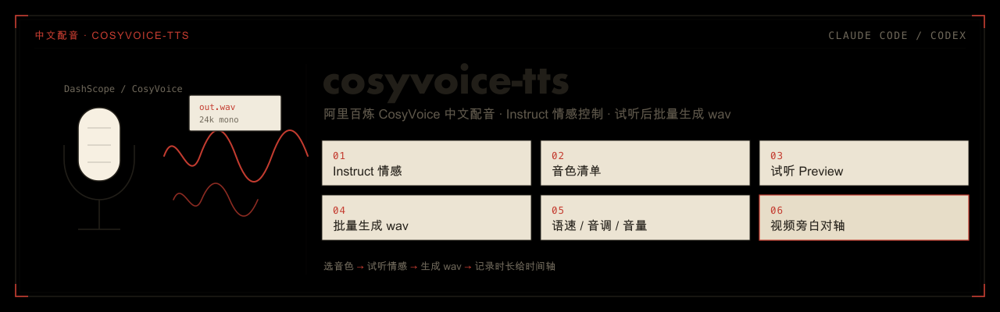

<p align="center">
  
</p>

# cosyvoice-tts

> 一个跨 **Claude Code** 与 **Codex** 的插件（基于开放标准 [skill](https://agentskills.io)）：用阿里百炼 CosyVoice 把中文文案合成自然语音。
>
> ← 返回[仓库总览](../../README.md) ｜ 姊妹插件：[privatize-fork](../privatize-fork/) / [context-doctor](../context-doctor/)

这个插件把你已有的 `cosyvoice-tts` skill 包装成标准插件：同一份技能可安装到 Claude Code 与 Codex。它重点封装 CosyVoice Instruct，用一句规定格式的指令控制情感、场景、角色和身份，同时支持试听音色、调语速音调音量、批量生成 `wav`。

## 解决什么问题

做视频、PPT、课件、演示或产品旁白时，常见问题不是“能不能合成语音”，而是每次都要重新写 SDK 调用、查音色、记模型和音色绑定、处理 Instruct 报错、再拿音频时长去对轴。

`cosyvoice-tts` 把这些固定动作收进一个技能：

| 能力 | 说明 |
|------|------|
| **音色清单** | 内置 `cosyvoice-v3-flash` 音色数据，可按场景列出音色，并标出支持 Instruct 的音色。 |
| **先试听再生成** | `preview` 合成一句并播放，适合快速比较音色和情感；`gen` 生成正式 `wav`。 |
| **Instruct 情感控制** | 支持 `neutral / happy / angry / sad / surprised / fearful / disgusted`，也能给场景、角色、身份。 |
| **自动回退** | 对不支持 Instruct 的音色会普通合成；取值不合规时尽量回退到纯情感，避免反复踩 `428`。 |
| **视频友好** | 输出统一规范化成 24kHz 单声道 wav，并打印时长，方便交给字幕或视频时间轴。 |

## 安装

插件名 `cosyvoice-tts@legdonkey`。完整安装方式（含桌面端图形界面、一键脚本 `install-plugins.sh`）见[根 README 的安装区](../../README.md#安装)。命令行速记：

```bash
# Claude Code
/plugin marketplace add legdonkey/legdonkey-plugins
/plugin install cosyvoice-tts@legdonkey

# Codex
codex plugin marketplace add legdonkey/legdonkey-plugins --ref main
codex plugin add cosyvoice-tts@legdonkey
```

装完重启对应客户端。触发名：**Claude Code** 用 `/cosyvoice-tts`（插件命名空间下 `/cosyvoice-tts:cosyvoice-tts`）；**Codex** 用 `$cosyvoice-tts`。**不会自动调用**——CC 靠 frontmatter `disable-model-invocation: true`、Codex 靠 `agents/openai.yaml` 的 `allow_implicit_invocation: false`，只能由你手动点名。

## 运行环境

这个插件会调用阿里百炼 DashScope API，并在本机生成音频文件。使用前需要：

```bash
python3 -m venv ~/.cosyvoice-tts-venv
~/.cosyvoice-tts-venv/bin/pip install dashscope
```

API key 读取顺序是环境变量 `DASHSCOPE_API_KEY`，然后是 `~/.dashscope_key`。推荐把 key 放到 `~/.dashscope_key`，不要写进项目文件或对话内容。

还需要本机有 `ffmpeg` / `ffprobe`；macOS 试听播放用系统自带的 `afplay`。

## 用法

手动触发后，告诉模型你要合成的文案、想要的语气和用途。典型流程是：

1. 先用 `list --instruct-only` 看支持情感控制的音色；
2. 用 `preview` 试听 1 到 2 个候选；
3. 确认音色和情感后，用 `gen` 批量生成 `wav`；
4. 如果用于视频，把每段时长交给视频或字幕工具对齐。

底层脚本是 `skills/cosyvoice-tts/scripts/tts.py`，会从自身相邻的 `references/voices_v3flash.json` 读取音色数据，不依赖固定安装路径。

## 插件结构

```text
plugins/cosyvoice-tts/
├── .claude-plugin/plugin.json      # CC 插件清单
├── .codex-plugin/plugin.json       # Codex 插件清单（skills 指向 ./skills/）
└── skills/cosyvoice-tts/
    ├── SKILL.md                    # 入口（禁自动调用，只手动点名才跑）
    ├── agents/openai.yaml          # Codex 专属元数据
    ├── scripts/tts.py              # CosyVoice 调用、试听、生成、规范化
    └── references/
        ├── voices.md               # Instruct 音色和排错说明
        └── voices_v3flash.json     # v3-flash 音色清单
```
