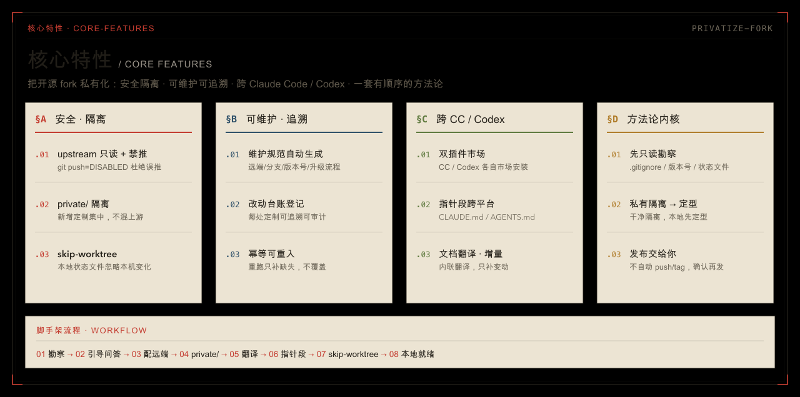

<p align="center">
  
</p>

# privatize-fork

> 一个跨 **Claude Code** 与 **Codex** 的插件（基于开放标准 [skill](https://agentskills.io)）：把 clone 下来的开源项目 fork **一次性私有化**。
>
> ← 返回[仓库总览](../../README.md) ｜ 姊妹插件：[codex-context-doctor](../codex-context-doctor/)

配好 upstream 只读跟踪 + 禁推、建立 `private/` 维护规范与改动台账、**由 skill 自己内联完成 upstream 初始化与文档翻译**、写好 `CLAUDE.md` / `AGENTS.md` 指针——让一个私有 fork 能长期跟踪上游稳定版，同时把私有定制干净隔离、可维护。

内置了从实战中提炼的方法论：**先勘察 → 私有隔离 → 本地定型 → 最后一次性发布**。

## 解决什么问题

团队基于开源项目做私有定制，真正的难点不是「改代码」，而是**缺一套能长期维护的私有规范**——于是每次升级 upstream 都像拆弹：

- **远端约定**：`origin`（自己的 fork）和 `upstream`（原作者）怎么分工？upstream 能不能推？
- **分支约定**：私有开发、合并 upstream 各走什么分支？能不能 rebase / force-push？
- **私有版本号**：私有 release 怎么编号，才能既对应 upstream 基线、又不和官方 tag 撞车？
- **升级与回滚**：升级到 upstream 哪个版本、怎么判断动了哪些文件、出问题怎么退回？

规范缺位，就会反复踩这些坑：

- 私有改动和 upstream 文件混在一起，升级时冲突地狱；
- 误把私有改动推到了原作者仓库（upstream）；
- 基建还没定型就打 tag + push，结果反复 `force-push` 移动已发布 tag；
- `.gitignore` 的通配规则悄悄挡掉了你新建的文件，或误删了上游「故意跟踪」的特殊文件。

**这个 skill 一次性把这套规范立起来**：生成 `private/README.md` 维护规范（远端 / 分支 / 私有版本号 / upstream 同步判断 / 升级流程 / 回滚预案 / 发布前检查），配套 `private/` 隔离目录与改动台账——让私有 fork 能被团队长期、可控地维护，而不只是「躲过几个坑」。

## 核心特性

<p align="center">
  
</p>

| 特性 | 说明 |
|------|------|
| **只读勘察暗礁** | 动手前先扫一遍 `.gitignore` 通配误伤、故意跟踪的文件、官方版本号位置、本地状态文件、upstream 最新 tag——把项目的坑全摸清再动手。 |
| **引导问答一次问全** | upstream 地址、私有 tag 格式、remote 协议、是否启用翻译模块、高冲突文件清单，能从勘察推断的给默认值。 |
| **upstream 只读跟踪 + 禁推** | 从 git 层面把 upstream 的 `push` 设成 `DISABLED`，杜绝误把私有改动推到原作者仓库。这一步即 init，幂等可重跑。 |
| **关键步骤固化为自检脚本** | 勘察、配远端禁推、判断待翻清单这三处「确定性强、又最怕模型凭印象跳步」的环节，抽成了幂等/只读的小脚本（`scripts/`）——尤其禁推闸会**自检 `push = DISABLED` 是否真生效**，不对就报错退出，不再单靠模型自觉；判断与翻译等需要灵活性的部分仍交给模型。 |
| **私有内容尽量隔离** | 新增定制集中进 `private/`，不往 upstream 目录塞新文件；确需直接改的上游文件登记入账、定好冲突策略，升级时有据可查。 |
| **维护规范自动生成** | `private/README.md` 含升级流程、私有 tag 约定、版本号位置、验证命令。 |
| **改动台账** | `private/CHANGES-REGISTRY.md` 登记每一处私有定制，可追溯、可审计。 |
| **可选文档翻译（内联 + 增量更新）** | skill **自己内联翻译** upstream 官方文档到 `private/translations/`，无需装命令。亮点是**增量更新**——每份译文记着译自哪个 upstream 版本，重跑 skill 时只重译源文件真正变动过的、补翻缺失的，已是最新的直接跳过；CC（`Agent` 子代理）与 Codex（subagent）等有并行子任务能力的 agent 并行翻译，仅在确无并行能力时才顺序进行。 |
| **指针段跨平台** | 按团队 agent 把「私有维护规范」指针写进 `CLAUDE.md`（CC）和/或 `AGENTS.md`（Codex），去重不重复追加。 |
| **本地状态文件 skip-worktree** | `.idea/`、`.vscode/`、`.obsidian/workspace.json` 等上游跟踪、每台机器不同的文件，逐个征得同意后让本机忽略其变化。 |
| **幂等可重入** | 可重复执行，已存在的文件一律不覆盖、只补缺失；**重跑 skill = 重配 upstream + 增量刷新翻译**，这就是后续维护要做的全部。 |
| **本地就绪，发布交给你** | skill 只做到「本地就绪」，不替你 push、不替你打 tag，确认无误后一次性发布。 |

## 安装

插件名 `privatize-fork@legdonkey`。**完整安装方式**（含桌面端图形界面、一键脚本 `install-plugins.sh`）见[根 README 的安装区](../../README.md#安装)。命令行速记：

```bash
# Claude Code
/plugin marketplace add legdonkey/privatize-fork
/plugin install privatize-fork@legdonkey

# Codex
codex plugin marketplace add legdonkey/privatize-fork --ref main
codex plugin add privatize-fork@legdonkey
```

装完重启对应客户端。触发名：**Claude Code** 用 `/privatize-fork`（插件命名空间下 `/privatize-fork:privatize-fork`）；**Codex** 用 `$privatize-fork`。**不会自动调用**——CC 靠 frontmatter `disable-model-invocation: true`、Codex 靠 `agents/openai.yaml` 的 `allow_implicit_invocation: false`，只能由你手动触发。

## 开始使用

1. clone 你的私有 fork 到本地（`origin` 指向你的 fork）；
2. 在**该项目目录**里打开 CC 或 Codex，手动触发（Claude Code 用 `/`、Codex 用 `$`）：

```
/privatize-fork      # Claude Code
$privatize-fork      # Codex
```

skill 会带你走完整个流程，最后把私有化基建留在**本地就绪**状态——**不替你 push、不替你打 tag**，发布留给你确认无误后手动做。后续维护（重配 upstream、刷新翻译）只需**重跑这个 skill**。

### 兼容性

`SKILL.md` 是 [agentskills.io](https://agentskills.io) 开放标准，同一份文件 CC / Codex / Gemini CLI / Cursor 等 30+ 工具通用。两边差异都已抹平：

| | Claude Code | Codex |
|---|---|---|
| 插件位置 | `~/.claude/plugins/` | `~/.codex/plugins/` |
| 禁自动调用 | `disable-model-invocation: true`（frontmatter） | `agents/openai.yaml` → `allow_implicit_invocation: false` |
| 选项弹窗 | `AskUserQuestion` | `request_user_input`（交互式会话即可，无需 `/plan`；仅 `codex exec` 非交互模式不支持） |
| 并行子任务 | `Agent`（子代理） | subagent |
| 指令文件（指针段） | `CLAUDE.md` | `AGENTS.md` |

## 实现方式与注意事项

### 它会做什么（8 个阶段）

| 阶段 | 动作 |
|------|------|
| 0 | 前置检查 + 重入守卫（已初始化则进增量模式，只补缺失、绝不覆盖） |
| 1 | 勘察（只读，跑 `recon.sh`）：远端协议、`.gitignore` 暗礁、版本号位置、本地状态文件、upstream tag |
| 2 | 引导问答：upstream 地址、私有 tag 格式、协议、是否启用翻译、团队用哪个 agent、高冲突文件清单 |
| 3 | 配 git 远端（即 init，跑 `setup-remote.sh`）：upstream 只读跟踪 + `push = DISABLED` + 自检 |
| 4 | 建 `private/`：维护规范 `README.md` + 改动台账 `CHANGES-REGISTRY.md` |
| 5 | 翻译（若启用）：`translate-plan.sh` 判增量清单 → skill 内联翻译变动文档 |
| 6 | 写指针段：`CLAUDE.md`（CC）和/或 `AGENTS.md`（Codex） |
| 7 | 本地状态文件按需 `skip-worktree`（逐个征得同意） |
| 8 | 收尾：汇总产物，给出发布命令但**不自动执行** |

### 四条铁律

1. **私有内容尽量隔离**：新增私有文件只进 `private/`（指针段除外）；不得不直接改 upstream 文件时，登记到改动台账并定好升级冲突策略。
2. **动手前先读 `.gitignore`**：上游忽略规则会误伤你将生成的文件，也会暴露它「故意跟踪」的特殊文件。
3. **重入安全（幂等）**：可重复执行，已存在的文件一律不覆盖，只补缺失。
4. **本地定型后再发布**：skill 只做到「本地就绪」，push 和打 tag 留给你确认无误后手动做。

### 插件结构

```text
plugins/privatize-fork/
├── .claude-plugin/plugin.json      # CC 插件清单
├── .codex-plugin/plugin.json       # Codex 插件清单（skills 指向 ./skills/）
└── skills/privatize-fork/          # 技能本体（CC/Codex 共用）
    ├── SKILL.md                    #   入口，唯一被识别的文件
    ├── agents/openai.yaml          #   Codex 专属元数据（禁自动调用；CC 忽略）
    ├── scripts/                    #   关键步骤固化的自检脚本（幂等/只读 + 自检）
    │   ├── setup-remote.sh         #     阶段3：配 upstream + 禁推闸 + 自检
    │   ├── recon.sh                #     阶段1：只读勘察
    │   └── translate-plan.sh       #     阶段5：判断待翻清单（增量比对）
    └── references/                 #   按需读取的模板/流程
        ├── maintenance-readme.template.md
        ├── changes-registry.template.md
        ├── translate-docs.md
        └── translations-conventions.template.md
```

### 方法论内核

这个 skill 的价值不在「自动化」，而在**顺序**：先勘察（把项目的暗礁全摸清）→ 再设计（私有内容尽量隔离，必改上游的登记入账）→ 本地定型 → 最后一次性发布。把顺序走对，就能少走绝大部分弯路。
